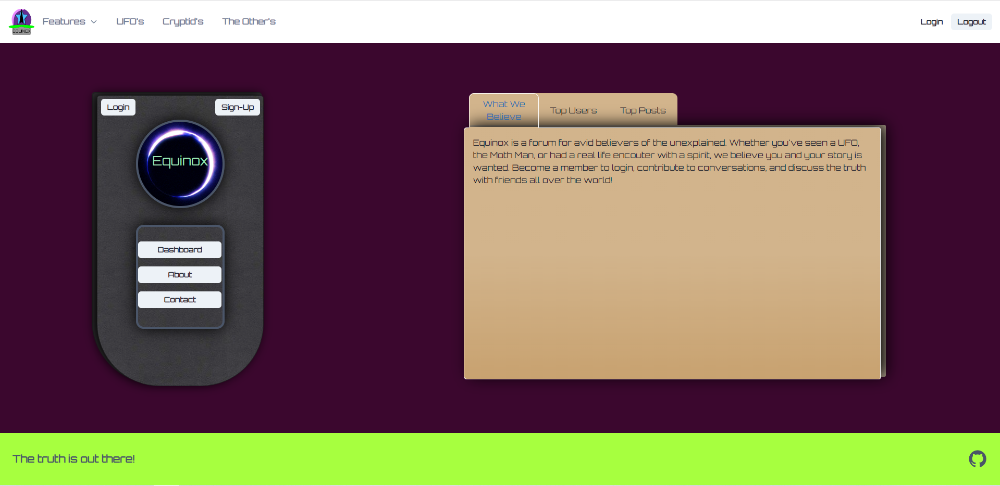

# Equinox

React Forum
Equinox is a full-stack MERN application that was designed and built collaboratively, then sent to deploy through Heroku. As the final project of our Web Development bootcamp, it is a symbol of the culmination of all skills taught and even more learned through trial and error. The task was to create a single-page application with a MongoDB back end, a GraphQL API, and an Express.js and Node.js server with a React front end which would implement user authentication with JWT to build a user-focused platform.

## Description

Equinox is a forum for avid believers of the unexplained. Whether you've seen a UFO, the Moth Man, or had a real life encouter with a spirit, we believe you and your story is wanted. Become a member to login, contribute to conversations, and discuss the truth with friends all over the world!

## Table of Contents

- [Usage](#usage)
- [Credits](#credits)
- [License](#license)

## Usage

After arriving to the forum, sign up to become a member and then sign in to begin interacting with others. Posts, comments, and a voting system will allow you to contribute in a variety of ways.

     

## Credits

**_Joshua Butts_** - Front End Developer Extrordinaire - [https://github.com/JCB44](https://github.com/JCB44)

**_Matthew Montiel_** - Project Management, Front End Developer - [https://github.com/MatthewMontiel](https://github.com/MatthewMontiel)

**_Lindsey Isaac_** - Front End Researcher, QC Analyst and Development - [https://github.com/LindseyIsaac](https://github.com/LindseyIsaac)

**_Jacqueline Martinez_** - Front End Researcher, Data Analyst and Presentation - [https://github.com/JackieAmartinez](https://github.com/JackieAmartinez)

**_Vincent Richards_** - Back End Researcher and Development - [https://github.com/vrich88](https://github.com/vrich88)

**_Daniel Cohen_** - Back End Researcher and Development - [https://github.com/dctristero](https://github.com/dctristero)

## License

MIT License

Copyright (c) 2023 Daja-limavijo

Permission is hereby granted, free of charge, to any person obtaining a copy
of this software and associated documentation files (the "Software"), to deal
in the Software without restriction, including without limitation the rights
to use, copy, modify, merge, publish, distribute, sublicense, and/or sell
copies of the Software, and to permit persons to whom the Software is
furnished to do so, subject to the following conditions:

The above copyright notice and this permission notice shall be included in all
copies or substantial portions of the Software.

THE SOFTWARE IS PROVIDED "AS IS", WITHOUT WARRANTY OF ANY KIND, EXPRESS OR
IMPLIED, INCLUDING BUT NOT LIMITED TO THE WARRANTIES OF MERCHANTABILITY,
FITNESS FOR A PARTICULAR PURPOSE AND NONINFRINGEMENT. IN NO EVENT SHALL THE
AUTHORS OR COPYRIGHT HOLDERS BE LIABLE FOR ANY CLAIM, DAMAGES OR OTHER
LIABILITY, WHETHER IN AN ACTION OF CONTRACT, TORT OR OTHERWISE, ARISING FROM,
OUT OF OR IN CONNECTION WITH THE SOFTWARE OR THE USE OR OTHER DEALINGS IN THE
SOFTWARE.

## Badges

## Features

Select from one of three sub-forums: UFO's, Cryptid's, and Other's
